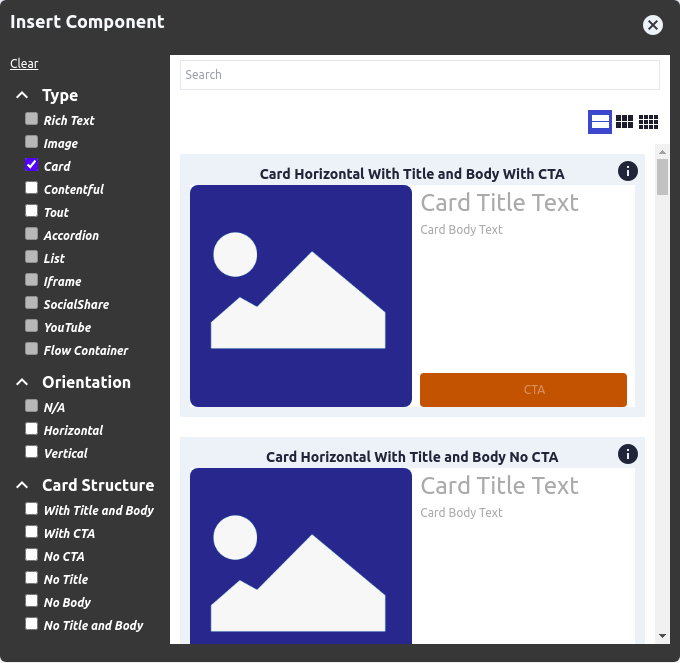
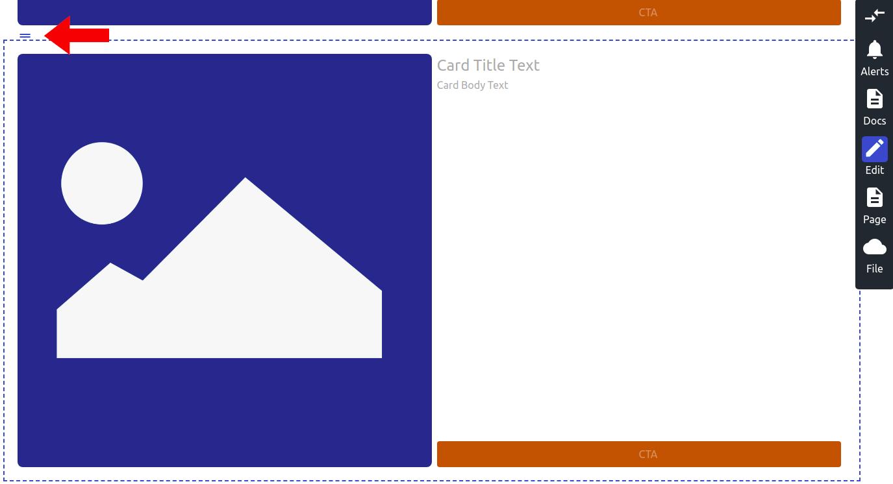

# Card Component

Card is a group of content which 
typically features a less than full size image alongside supporting 
content or a call to action (CTA). Cards are commonly used on websites to 
call out or offer something to the site visitor. The card component allows
site builders to configure and modify cards according to the site design.

Basic cards usually consist of some or all of the following components:
* **Title:** Text editable via simple text editor.
* **Image:** Image component - linkable or not linkable.
* **Description:** Text editable via basic text
editor.
* **CTA Button:** Text editable via simple text editor. Link component
to configure link.

## Content Editor Details

BodilessJS by default offers basic layout options for both vertical and
horizontal cards. For both horizontal and vertical options you can choose to
include the following: title, body text, CTA.

To place a card on your website click on the +Add button on the toolbar.

1. Select the type of card you'd like to use. You can use the filters in the
component window to narrow your selection.  


2. Once you have selected the appropriate card you can edit the various
components via the context menu.
    * e.g. For a horizontal Card with Title, Body and CTA

3. Resize the card by clicking near the blue line on the righthand edge of the
flow container box and dragging to expand or contract.


5. Re-position the card on the page by clicking near the two lines at the top
left of the card's flow container box and dragging to the desired place on your
page.  


---

## Site Builder Details

### Card Variations with combining tokens

The card can be composed of different tokens (see
[code](../src/components/Cards.tokens.tsx)) to
create many card variations. These variations include:

* Horizontal 
* Vertical 
* No Title 
* No Body 
* No CTA 
* Overlay of CTA 
* Overlay of title

### Usage

```
const CardVerticalNoTitle = flow(
  asCardWithPaddings, asCardDefaultStyle, asCardVertical, asCardNoTitle,
)(Card); 
```

---

## Architectural Details

The Card renders as a block of html with the following:

```
    <Wrapper {...rest}>
      <ImageWrapper>
        <ImageLink>
          <Image />
        </ImageLink>
      </ImageWrapper>
      <ContentWrapper>
        <Title />
        <Body />
        <Link />
      </ContentWrapper>
    </Wrapper>
```
