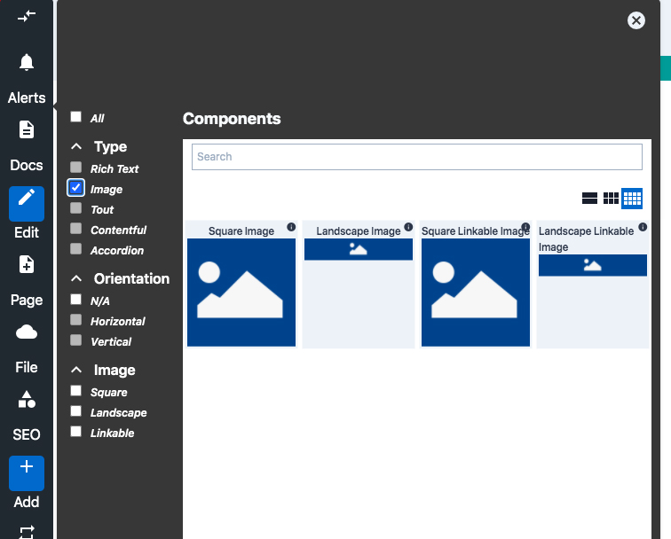

# Image Component

The Image Component in BodliessJS allows you to easily add images to your site.
Images can be either landscape or portrait mode depending on your layout needs
and can be either linkable or not. 

## Content Editor Details

To add an Image to your site:

1. Highlight a [Flow Container](../../../Components/FlowContainer). 

2. Click on the +Add icon in the toolbar, or if you are swapping components
click the Swap icon.


3. In the Component Library select which type of image you would like to
display. The BodilessJS Starter Kit provides the following image options by default. 
Your site may provide a different array of options for the image component.
    * Square
    * Landscape
    * Square Linkable
    * Landscape Linkable

4. Once you have selected the appropriate image type you can add the image and
image alt text using the context menu.


5. Once you are done selecting your image and have entered the alt text, click
the checkmark or hit enter.

6. You can resize the image by clicking and dragging on the the right hand side
of the Flow Container.

Images are parts of cards. For more information on adding images to
cards see the [card documentation](../../../Components/Cards).

---

## Site Builder Details

You can use this to place an image (usually an `img` tag) on a page via the BodilessJS 
edit interfce and allow the src and alt text to be editable. The edit
interface also supports image upload.

  ``` 
  js import Image from '@bodiless/components';

  <Image nodeKey="imageit" /> 
  ```

You can also use the HOC version of this which can then be applied to other
components.  But the underlying component must accept the same props as an
`img` tag. Simply pass the node key to the asBodilessImage function and then use
the returned HOC

  ```
  js import { CustomImage } from 'my-library'; import { asBodilessImage }
  from '@bodiless/components';

  const Image = asBodilessImage('linkit')(CustomImage);

  <Image />
  ```

You can also enhance Image picker UI elements. A list of UI elements that can be
enhanced can be found in TImagePickerUI type exported by Image. In order to
enhance a UI element, the enhancement should be injected as ui prop to the Image
element. To customize master wrapper element:

```
js import { Image } from '@bodiless/components';

const UploadArea = () => <div>Some custom text that guide users how to upload
image</div>; const ui = { UploadArea };

<Image ui={ui} />
```

In order to find a complete example how to build a custom UI for Image picker,
see @bodiless/components-ui.

---

## Architectural Details
