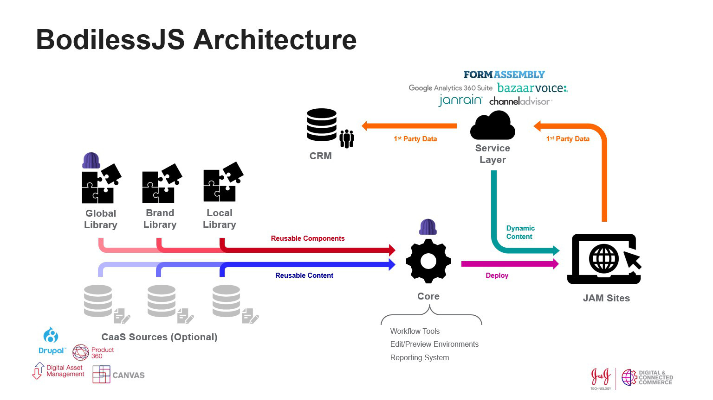

# Architecture

This page provides a high-level overview of the basic architecture of the
BodilessJS system, as well as a look at some of the motivations that guided the
decisions behind its design.

For a more thorough reading of this topic, please see the
[Development/Architecture](../Development/Architecture/) section.

## Why BodilessJS?

Our [core principles](../../About/CorePrinciples) and architectural choices of
BodilessJS were driven by difficulties experienced with other site-building
platforms. These difficulties include:

- **Operational Rigidity:**
  - Monolithic codebases often have rigid workflows and heightened platform
    complexity, increasing the time to market and the cost of platform upgrades.
- **Feature Bloat:**
  - A "kitchen sink" approach means that many platform customers will receive
    (and pay for) features they don't use.
  - Performance degrades as platform complexity increases.
- **Unsustainable Customization:**
  - Brand differentiation, agency "innovation," regional requirements, and lack
    of governance can drive departures from platform standards. With opinionated
    or rigid platforms, these departures can create unsustainable
    customizations, driving up the cost of releases, upgrades, and maintenance.

To combat these difficulties, BodilessJS employs a number of architectural
decisions that are explained in the following sections:

- **[JAMstack](#jamstack):**
  - Allows for static sites with streamlined workflows.
- **[Reusable Components](#reusable-components):**
  - Allows your sites to pull in only the components they need.
  - Components can come from multiple teams, each potentially owning multiple
    component libraries.
- **[Content](#content):**
  - Content can be internal (stored as code in your codebase) or external
    (pulled in from a CMS or CaaS), allowing your site to grow with its needs.
- **[Core](#core):**
  - Bundles your components and content together into a static site.
  - Provides an easy-to-use editor interface for content that isn't externally
    sourced.

## JAMstack

BodilessJS is built upon the _JAMstack_, a generic architectural pattern built
around client-side web technologies—technologies that are traditionally run in
the browser, as opposed to the server. The "JAM" in JAMstack is an acronym for
_JavaScript_, _APIs_, and _Markup_:

- **JavaScript:**
  - Any dynamic programming during the request/response cycle is handled by
    JavaScript, running entirely on the client.
  - This could be any frontend framework, library, or just vanilla JavaScript.
- **APIs:**
  - All server-side processes or database actions are abstracted into reusable
    APIs, accessed over HTTP with JavaScript.
  - These can be custom-built or leverage third-party services.
- **Markup:**
  - Templated markup should be prebuilt at deploy time, usually using a site
    generator for content sites, or a build tool for web apps.

Using this stack, deployments generate static sites, which provide numerous
benefits, including the following:

- They have low hosting costs, as they are pure HTML/CSS/JS and don't require
  server-side resources;
- They remove attack vectors, as there is no edit interface in production that
  can be hacked;
- They allow for performance optimizations, as their flat files are highly
  cacheable.

With no need to clone databases or perform complex installations, JAMstack sites
can have streamlined staging and testing workflows. Sandbox environments can be
created, as needed, per change request, meaning multiple sandboxes can be spun
up, with different items being worked on simultaneously. This eliminates the
need to manually coordinate multiple change requests occurring on a single
staging environment.

Also, as everything is stored as code, content and styling changes can be done
together, in a single sandbox environment. This allows a reviewer (developer, QA
specialist, and/or stakeholder) to see exactly what a change will look
like—presentation and all. Once approved, the change (content _and_
presentation) can be deployed to production; there is no need to coordinate
database and code updates for a single change.

For more information, see: [Jamstack.org](https://jamstack.org/).

## Reusable Components

The basis of Bodiless is this notion of decoupled, reusable components. Bodiless
has multiple independent libraries that individual sites can pick and choose
from. This is in contrast to platforms where components—in order to be reusable
in a sustainable way—have to be integrated into the global platform.

One big benefit of this architecture is that it enables you to have multiple
teams that own multiple libraries. If you are a company with multiple
brands/products and multiple brand/product sites, you could have a global team
that owns a global library, and specific teams that own their own brand/product
libraries.

Basically, you can have reusable components coming from global libraries, brand
libraries, and local (e.g., regional/market) libraries. There could be, for
example, basic functional things coming from from a universal/global library,
and more site-specific things (e.g., theme styles, layout patterns, etc.) coming
from a brand library. This allows you to easily pull in components from one
library, and have them automatically styled and themed by your site-specific
library.

You can also extend external components with desired functionality. For
instance, if a library provides a list component, and it uses text-based
bullets, but you want image-based bullets—instead of having to build a whole new
list component—you could write a layer on top of the existing component,
extending its functionality to allow for images.

It's worth noting that while all of this flexibility is possible, it is also
possible to have a single centrally-governed library.

The ability to have these multiple libraries maintained by multiple teams is
largely made possible by the Bodiless architecture supporting the concept of
_vertical decoupling_, allowing for the independent implementation of parts. So,
you can build a new component without needing to understand existing components,
as well as make changes to a component with confidence that it won't break the
functionality of another. Not having to be concerned with the functionality or
styling of other components accelerates the development workflow, as it reduces
the learning curve and eliminates the need for extensive regression testing.

## Content

Using Bodiless for a simple site, you can have all of your content managed by
the components themselves, saving it as code in your repository, and you won't
have to connect to an external database. This provides numerous benefits:

- An easy editor experience, using the editor interface provided by Bodiless
  Core;
- A historical record of content changes, managed with version control software
  (e.g., Git);
- Low hosting costs, as everything can be stored in your repository, without the
  need for server-side resources;
- Flat files are easily cached by a CDN, providing optimized performance for
  your site.

Because storing all of your content as code comes at the cost of some of the
richer experiences and robust integrations that can come with using external
content sources, Bodiless also allows you to pull in content from as many
sources as you require; each of these sources being a _Content Management
System_ (CMS) or _Content as a Service_ (CaaS).

For example, you can have multiple services that manage specific types of
content (e.g., products, images, etc.), or you can have a model where all of
your content is managed by a single system (e.g., Drupal).

While there is some inherent complexity when you use external content—and this
complexity builds as you introduce more services—that content is accessible from
multiple places and components, and is able to have a centralized source of
truth for each of its content types.

In supporting this range of content possibilities, Bodiless allows you to grow
with your needs. Your site could start without external content, with all of the
content being managed by the frontend components; then, as your site grows and
your content-related feature requirements mature, you could begin introducing
external content services to fit your needs.

## Core

The Bodiless core system takes the components that you want to use, pulls in any
static content that you want from external sources, bundles it together, and
deploys it as a static JAM site.

Any data or content that needs to be pulled in dynamically could be done so via
JavaScript through APIs, or via other types of integrations (e.g., an iframe
injecting a particular experience into your markup). Of course, this dynamic
functionality extends to the capability to collect first-party data, analytics,
etc.

For content that is not being brought in from an external source, the core
system provides an editor interface for editing and managing that content, as
well as the ability to preview it.
