# Content Editor Guide

BodilessJS provides tools which allow non-developers to edit content inline
using a browser, referred to in this document as the Edit Interface. For more
information about launching the Edit Interface please see the [Getting Started
documentation](../../../About/GettingStarted?id=creating-a-new-site) - _note this 
will require some technical experience._

This guide focuses on 3 main parts:
1. Edit Interface - including how to work with the tool bar and the editing
modes.
1. Page Layout and working with the Flow Container.
1. How to work with Components to create content.

To learn how to launch the Edit Interface please see the [Getting Started
documentation](../../../About/GettingStarted?id=creating-a-new-site)

## Edit Interface

The Edit Interface has two modes: **Review Mode** and **Edit Mode**. Review Mode
allows you to interact with your site as an end user would, while Edit Mode
allows you to edit content directly on your site. The Edit button on the Toolbar
lets you quickly toggle back and forth between edit mode and review mode.

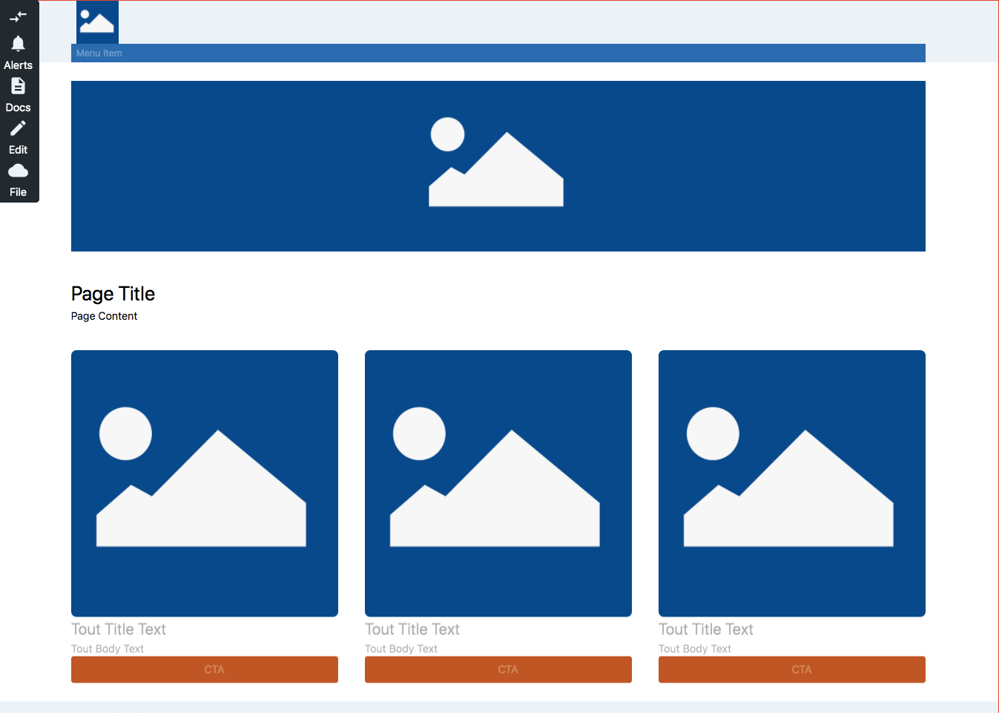

### Review Mode

The Edit Interface defaults to the Review mode. In Review Mode, you can navigate
through the pages of the site to quickly access and assess what you need to edit.
You use the site's navigation to quickly access the content you need to edit.

In Review Mode, the toolbar on the lefthand side of the screen offers a subset
of functionality to interact with the site.

### Edit Mode

The Edit mode is where you can do the actual work of updating the site content. 

Clicking on the **Edit** pencil icon in the Tool Bar will transition the site into Edit
Mode. Point and click to where you want to be on the page, and then make the
change directly on the page. You can see your changes in the context of your
site's content.

_In Edit Mode the *Edit* icon will appear highlighted in blue._ 

### Toolbar

In your site's edit interface - in both Review mode and Edit mode - you will
find a toolbar. The toolbar will appear differently depending on the mode. By
default, the edit interface begins in review mode. 

| Review Mode | Edit Mode |
|-------------|-----------|
| 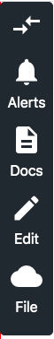 | 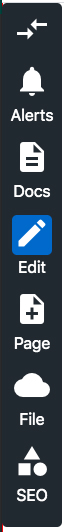 |

* #### Location Switcher

  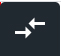

  The default position of this toolbar is the lefthand side of the page. You can
  click the location switcher button to move the admin toolbar to the righthand
  side of the page, or back again, if it obscures content.

* #### Alerts

  

  The **Alerts** button on the Toolbar notifies you when there have been changes
  in your site's environment. If changes exist the Alerts button will be
  highlighted with blue and display a ''!'' in the bell icon. Clicking on the
  Alerts button will display the notifications and give you details on how to
  resolve the issue (e.g. "Your branch is outdated. Please pull remote
  changes.")

* #### Docs

  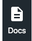

  The **Docs** button opens BodilessJS documentation in a new browser tab.

### Workflow

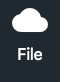

The **File** icon gives you the ability to manage your site's workflow. The
following options are available in the File submenu: Pull, Push, Revert,
History.

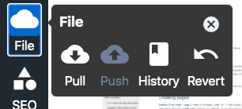

* #### Pull

  The Pull button will pull the latest code from your site's repository.

* #### Push

  With the Push button you can commit your local changes to your site and push
  them to the appropriate branch.

* #### Revert

  The Revert button can be used to undo your local changes.

* #### History

  The History button allows you to view the most recent changes to your site's
  code.

#### SEO Metadata

Metadata is used by search engines such as google to understand information
about a webpage. Search engines can use this information for ranking purposes or
to display snippets in search results. The SEO icon offers an interface so that
you can manage your site's metadata. Here you can enter a page's Title,
Description and Page Type so that your page's search engine result page will be
as effective as possible. 

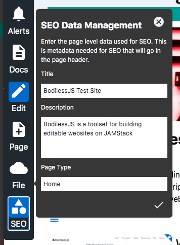

* Title: Usually shown as title in search results 
* Description: Usually shown
in snippet for search results.  
* Page Type: Used to categorize web pages. 

#### Edit Mode

Clicking on the *Edit* icon in the Tool Bar will transition the site into Edit
Mode. _In Edit Mode the *Edit* icon will appear highlighted in blue._

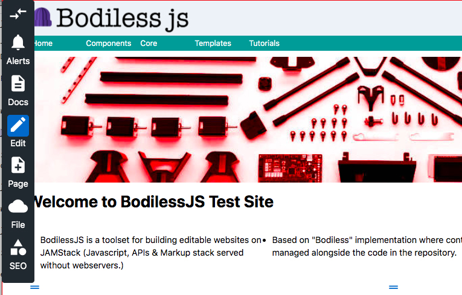

#### Page

Clicking the Page button will create a new page for your site. 

When you click on the Page button you will be prompted to enter the url you wish
to use for the new page. 

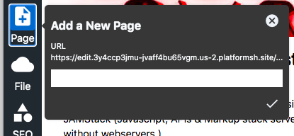

Enter the new url and then click the checkmark to finish creating the new page.

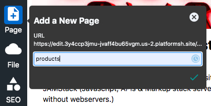

In BodilessJS, pages utilize
[templates](../../../Development/Guides/BuildingSites/Templates/?id=templates-overview).
Developers use templates to define page layout to maintain uniformity and
consistency across content types and sections.

Pages are added as part of the section in which it was created. The newly
created page will use the
[template](../../../Development/Guides/BuildingSites/Templates/?id=templates-overview)
associated with that section.

To create a new page click on the "Page" button in the toolbar.

### Page Layout

#### Flow Container

In BodilessJS pages can be laid out using the Flow Container. The Flow Container is a
layout tool which uses css flexbox templates to form the skeleton of BodilessJS
pages. Within the Flow Container, components can easily be moved around and
resized. 

When an empty Flow Container is on the page you will only see a single empty
line.

#### Add a new component

When you activate a Flow Container you will be able to add a new component 
to the Flow Container via the menu.

#### Component Library

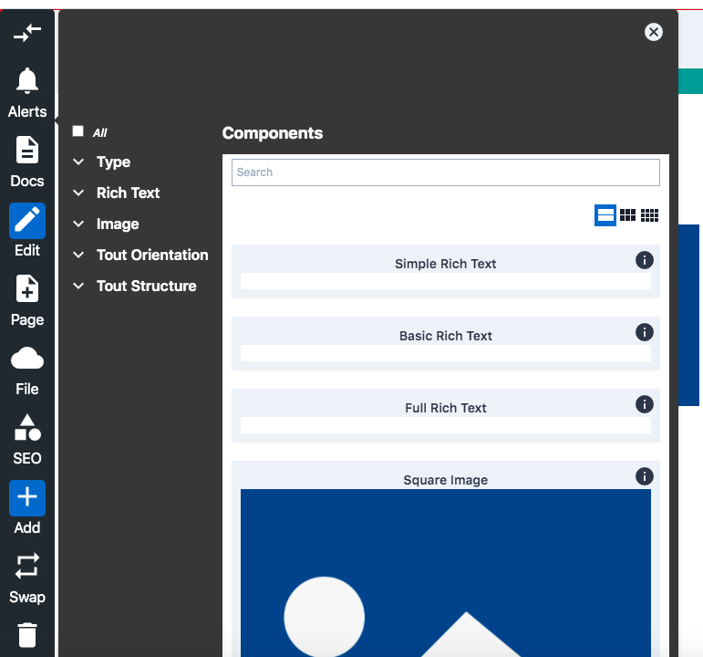

The component library allows you to change components on your page so that you
can easily update the layout of your site. 

By clicking on the component library button you can scroll through all of the
available components. You can filter the components by:

* Using search facets to filter out components that do not match the selection
(you can undo this by clicking the "select all" checkbox at the top).
* Using the search box field to search across all of the component titles.  
* You can hover over the information icon to see a description of the component.

When you have found the right component, simply click on it, and it will be
added at the end of the activated Flow Container.

#### Removing a component

When any component in the Flow Container is active it will provide a delete button 
to the context menu. Clicking on this icon will remove the component.

#### Resizing a component

When any component in the Flow Container is active it will appear with a blue border. 
You can resize the component by clicking on the right edge of the border. 

_Note:_ This can be done at different breakpoints to adjust the size of the component 
at that breakpoint and above.

The sizes are finite and defined by the creator of that particular Flow
Container. Smaller breakpoints will offer fewer options for resizing.

#### Reordering a component

When any component in the Flow Container is active it will appear with a blue double line 
icon in the top left corner of the component. By clicking and dragging this icon you can 
reorder components in the Flow Container.

#### Replacing a Component

To change a component's type you must remove that component and replace it with the new 
component type.

#### “Contentful” Components

While building sites, there are often use cases where content is re-used between
pages or components, or you might want to share a component with another site.
Contentful components are components that are preloaded with data so that you
can easily populate your site with content. These contentful components will
render the default content but you can easily override and edit the content to
suit your needs.

For information on layouts and working with the Flow Container see the [Flow Container documentation.](../../../Components/FlowContainer)

## Working with Content

As mentioned above, BodilessJS uses a series of interchangable and modifiable
components to build your site. See below for more information and links to
technical documentation for individual components.

#### Context Menu

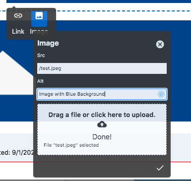

The context menu allows you to easily access commands so that you can edit
components' content directly on the page where it appears. As the name implies,
the Context Menu will appear differently depending upon the component you're
editing. The Context Menu contains commands such as:

* Add
* Delete
* Undo
* Link
* Image
* Groups
* Edit
* Swap

#### Rich Text Editor

The Rich Text Editor allows you to easily add text content to your site. By
default there are three options for the Rich Text Editor: Simple, Basic, and
Full. The Rich Text Editor is also a sub component of many of the components
listed below (i.e. you can add text to a page on your site via the editor or you
can add a component or components that contain text, which make use of the
editor).

| Simple | Basic | Full | 
| -------|-------|------| 
| |  |  | 
|The Simple Rich Text Editor offers the following formatting options: Superscript | Basic Rich Text Editor offers the following formatting options: bold, italic, underline, link, left alignment, right alignment, center alignment, justification alignment, superscript | The Full Rich Text Editor offers the following formatting options: bold, italic, underline, link, left alignment, right alignment, center alignment, justification alignment, superscript, header |

?> Please note that the above configurations are examples of the default options.
The site requirements and site builder will determine which rich text editor
options are available, where they are available to the editor, and which options
are available for each variation.

To read more about the Rich Text Editor see the [Rich Text Editor component
documentation](../../../Components/RichText).

### Components

The following components may be available for use on your BodilessJS site. Click
the links below to read more about working with the individual components.

#### Layout

* [Flow Container](../../../Components/FlowContainer) 
* [Rich Media Text Editor](../../../Components/RichText)
* [Card](../../../Components/Card)

#### Media

* [Image](../../../Components/Image)
* [Youtube](../../../Components/YouTube) 
* [Carousel](../../../Components/Carousel)

#### Interactions

* [Link](../../../Components/Link) 
* [Single Accordion](../../../Components/SingleAccordion) 
* [Main Menu](../../../Components/MainMenu)
* [List Filter](../../../Components/FilterByGroup)

#### Integrations

* [Bazaarvoice](../../../Components/bv)

#### SEO
 
* [Sitemap.xml](../../../Development/Guides/BuildingSites/ComponentsStarterKit?id=sitemapxml-amp-robotstxt-file) 
* Robots.txt 
* [Metatags](../../../Development/Guides/BuildingSites/ComponentsStarterKit?id=metadata-component) 

