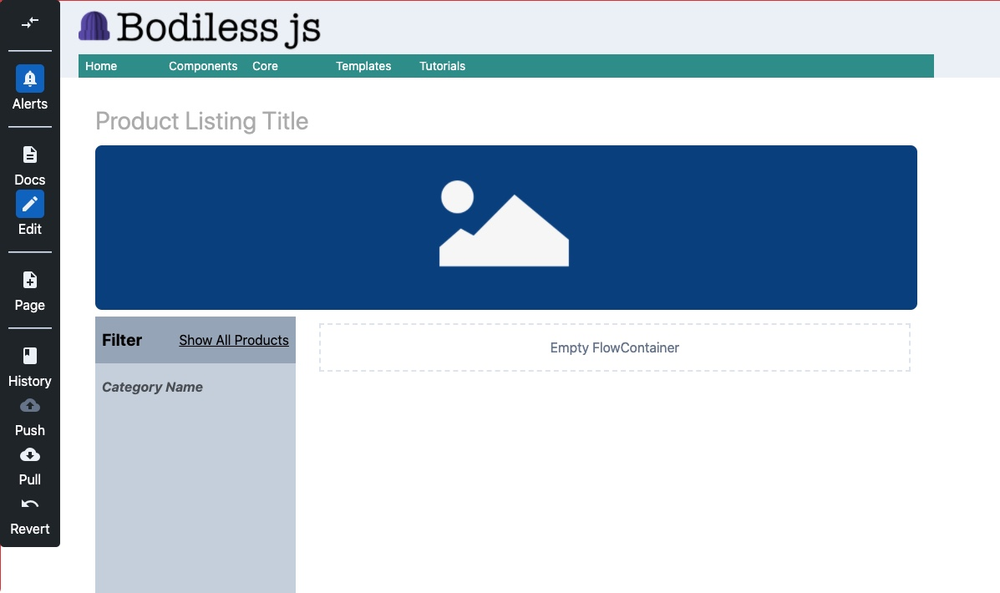

# Product Listing Page Template

The [Product Listing Page](https://github.com/johnsonandjohnson/Bodiless-JS/blob/master/examples/test-site/src/templates/product_listing.jsx) template is a very opinionated version of a product listing page.  It can easily be changed or re-designed to meet the site requirements.



## Overview

The Product Detail Page has the following componets:
  * Page Title (Rich Text Editor component)
  * Header Image (Image component)
  * Product Filter (custom FilterByGroup Component)
    * This is an HOC that renders a Product Filter on left and a taggable Product
    flowContainer on right.
    * The FlowContainer on right component allows addition of customized product taggable cards.

## Usage

1. The [Product Listing Page](https://github.com/johnsonandjohnson/Bodiless-JS/blob/master/examples/test-site/src/templates/product_listing.jsx) template can be copied into your `src/templates` folder and customized.

2. The additional components it uses should also be imported, copied and styled as needed or removed.
    * [Components/ProductListing](https://github.com/johnsonandjohnson/Bodiless-JS/tree/master/examples/test-site/src/components/ProductListing)
      which contains some simple HOC's and styling for this page.
    * [Components/Products](https://github.com/johnsonandjohnson/Bodiless-JS/blob/master/examples/test-site/src/components/Product/index.tsx)
      which contains some simple HOC's and styling for this page.
    * [FilterByGroup](https://github.com/johnsonandjohnson/Bodiless-JS/tree/master/examples/test-site/src/components/FilterByGroup)
      which contains a HOC that renders a Product Filter on left and a taggable
      Product flowContainer on right.

3. Specify the templates to use the template via `index.json` file.
  * Create a folder in `src/data/pages` such as `src/data/pages/products` and
    specify the `index.json` to use this template.

  e.g.
    ```js
      {
        "#template": "product_listing",
      }
    ```
