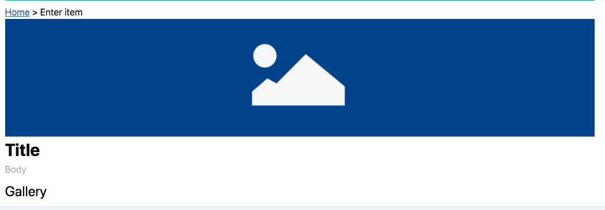

# Intro To Bodiless Concepts: Creating a Gallery Page

In this step-by-step tutorial you will gain experience with BodilessJS concepts
while building a simple gallery page on an editable BodilessJS site.



Upon completion of this tutorial you will end up with code similar to that found
[here](https://github.com/johnsonandjohnson/Bodiless-JS/tree/master/examples/test-site/src/data/pages/gallery-final).
As you go through the tutorial feel free to reference this code as needed.

> Note: The API's described below are under active development and are subject
> to change.

## Prerequisite: Create a Site

To begin, follow the directions to
[create a new site](../../About/GettingStarted?id=creating-a-new-site). All the
pages created in this tutorial will be in this new site.

## 1. Create a Page

BodilessJS will create a page for every subdirectory under the `src/data/pages`
directory. The URI path for the page will be the relative to the directory.

For example, if your site is served at "mysite.com", the directory at
`src/data/pages/foo/bar` will be served at `mysite.com/foo/bar`.

Create a directory at `src/data/pages/my-first-page` and place an `index.tsx` file in
that directory (Note: typescript is not a requirement. You can create an
`index.jsx` instead, but you will have to remove the type information from the
examples below). You can use the following as a starting point:

```ts
import React from 'react';
import { graphql } from 'gatsby';
import { Page, PageProps } from '@bodiless/gatsby-theme-bodiless';
import Layout from '../../../components/Layout';

export default (props: PageProps) => (
  <Page {...props}>
    <Layout>
      <h1>About BodilessJS</h1>
      <p>
        Donec metus sapien, cursus vel cursus quis, accumsan vitae purus.
        Nunc aliquet purus molestie mauris pellentesque pretium. In vel
        scelerisque felis. Vestibulum varius interdum nunc, non tincidunt magna
        posuere id. Proin vel purus mattis, interdum mi ac, suscipit lorem.
        Donec quis velit varius, sagittis quam eu, fermentum metus. Morbi a
        pretium dui. Maecenas condimentum pellentesque convallis.
      </p>
    </Layout>
  </Page>
);

export const query = graphql`
  query($slug: String!) {
    ...PageQuery,
    ...SiteQuery
  }
`;
```

A few things to note:

1. The whole page, *including the layout*, is wrapped in the `Page` component
   from `gatsby-theme-bodiless`. This encapsulates the editing framework.
1. A page query incorporating two fragments, also defined in
   `gatsby-theme-bodiless` ensures that Bodiless is able to find and load
   content for the page.

Now start the development server (`npm run start`) and navigate to
`localhost:8000/my-first-page`. This is just a basic Gatsby page - nothing remarkable
yet (except Gatsby itself, of course!).

### Creating Pages from the UI

You can also create pages directly from the UI using the *Page* button on the
left sidebar. You will be prompted for a path for the new page, *relative to the
current page path.* If page creation is successful, you will be redirected to
the new page after a few seconds. The new page will be created using a default
template located at `src/templates/_default.tsx`. After creating a page, look in
the corresponding directory in the filesystem
(e.g.: `src/data/pages/{path/to/your/page`). You should see an `index.json` with the
following contents:

```
{
  "#template": "_default"
}
```

You can modify the template by editing the contents of this file - or remove the
file entirely and replace it with a custom page component. For more information,
see [Creating Pages](../Architecture/Data?id=creating-pages).

## 2. Styling the Page Title using Functional CSS and Design Token HOC's

BodilessJS allows you to style your site using any technique you prefer.
However, we recommend using
["Functional" or "Atomic" CSS](https://johnpolacek.github.io/the-case-for-atomic-css/),
and building your UI as a set of composable *Design Tokens* expressed as React
higher-order components. This is the pattern used in the examples below, and the
`@bodiless/fclasses` library contains some utilities to make it easier.  We also
use the [Tailwind](https://tailwindcss.com) library to generate our utility classes.

Begin by refactoring the page title using this pattern. Add the following
imports to your `index.tsx`:

```ts
import { addClasses, H1 } from '@bodiless/fclasses';
```

Now, create a reusable primary header token by adding the following above the
default export:

```ts
const withPrimaryHeaderStyles = addClasses('text-3xl font-bold');
const PrimaryHeader = withPrimaryHeaderStyles(H1);
```

A *design token* for our sites primary headers, and a component to which that
token is applied have been created. The value of creating (and exporting) both
will become more apparent once the
[Design API](../Architecture/FClasses?id=the-design-api) is in use.

Now replace the `<h1 ...>` tag:
```ts
<PrimaryHeader>About BodilessJS</PrimaryHeader>
```
Note that the token is applied to the imported `H1` component. This is because
the class utilities provided by `@bodiless/fclasses` must operate on a
`stylable` component. The definition of `H1` (from `@bodiless/fclasses`) should
make this clear:
```ts
export const H1 = stylable<HTMLProps<HTMLHeadElement>>('h1');
```
We could have defined our token as:
```ts
const withPrimaryHeaderStyles = flow(stylable, addClasses('text-3xl font-bold`))
```
but, fortunately, you don't have to, since `@bodiless/fclasses` exports a
stylable version of every HTML element. If you revisit the
`localhost:8005/my-first-page` the header is rendered with the h1 and new classes.

You can read more about this pattern for building out a site's UI in our
[Design System documentation](../../Design/DesignSystem).

## 3. Making the Page Title Editable

Bodiless provides a number of core HOC's To make various components editable.
The simplest of these is`asEditable` - a simple, unformatted text field.

Add the following import to the top of your index.tsx:
```ts
import { asEditable } from '@bodiless/components';
import { addClasses, H1, asToken } from '@bodiless/fclasses';
```
And then update your `PrimaryHeader` definition to make it editable:
```ts
const PrimaryHeader = asToken(
  asEditable('title', 'Title'),
  withPrimaryHeaderStyles,
)(H1);
```

Navigate to `localhost:8005/my-first-page` again. Click on the "About
BodilessJS" text and start typing. The text is editable! Now refresh the page.
The title has been saved!

### What's happening here?

The `asEditable()` HOC used above, adds a special `Editable` component as a
child of the wrapped component. The above is exactly equivalent to (and could
have been written as):

```ts
<PrimaryHeader>
  <Editable nodeKey="title" placeholder="Title" />
</PrimaryHeader>
```

(Again, the version using HOC's shows it's real value when using the
[Design API](../Architecture/FClasses?id=the-design-api)).

The `Editable` component is basically just a `contenteditable` span which is
wired to the BodilessJS data framework. As you type, it posts updated content to
a lightweight node server, which serializes the content to disk (you can see the
POSTS in the network tab of your dev tools as you type).

The `nodeKey` you provided as an argument to `asEditable()` (or as a prop to
`Editable`) tells BodilessJS *where* to store the JSON file. After adding some
content, you should see a `title.json` file at `src/data/pages/my-first-page`, and it
should look something like this:

```json
{
  "text": "Whatever you entered..."
}
```

Try editing the json file using a text editor - change the value of the `"text"`
key. You should see the content update in the browser without reloading,
courtesy of `gatsby-source-filesystem` and hot reload. Or, open the same url in
a different browser window and start editing - the changes will propagate to the
other window in near-realtime. Cool!

Note the use of `asToken` in the above code. This is a custom composition
utility provided by BodilessJS. We will go into it in more detail in subsequent
tutorials; for now, just treat it as an equivalent to Lodash
[flow](https://lodash.com/docs/4.17.15#flow).


## 4. Adding Images and Links to the Page

BodilessJS has built-in support for editable images and links, so let's add an
image link to our page.

Change the imports from `@bodiless/components` and `@bodiless/fclasses`;

```ts
import { H1, Img, A, addClasses, asToken } from '@bodiless/fclasses';
import { asEditable, asBodilessLink } from '@bodiless/components';
import { asBodilessImage } from '@bodiless/components-ui';
```

Now define your editable `Image` and `Link` components:

```ts
const Link = asBodilessLink('hero-link')(A);
const Image = asBodilessImage('hero-image', {
  src: 'http://via.placeholder.com/6000x1200.png',
  alt: 'Hero Image',
  title: 'Hero Image',
})(Img);
```

And add the following above the `<PrimaryHeader>` tag:

```
{/* eslint-disable-next-line jsx-a11y/anchor-is-valid */}
<Link><Image /></Link>
```

> *Note - the jsx-a11y linting rule is disabled because the Link component provides
> its own `href` attribute from the content.*

Reload your page and click on the image placeholder. Image and link edit buttons
will appear; you can use them to upload and image and set the `href` of the
link.

Look in `src/data/pages/my-first-page`. You should now see two new `json` files:
`hero-link.json` and `hero-link$hero-image.json`. The first will contain the
data you entered for the link, the second the data you entered for the image. As
with the simple editable, the names of these files are defined by the 'nodeKey'
passed as an argument to `asBodilessLink` and `asBodilessImage`. This could also
have been supplied in JSX:

```
<Link nodeKey="hero-link">
  <Image nodeKey="hero-image" />
</Link>
```

Note the name of the file containing the image data. Because the image element
is a child of the link, its content file is namespaced to its parent. This
allows you to compose editable primitives into reusable components. We'll come
back to this later.

Note also the second argument to `asBodilessImage` above.  This is a way to provide
a placeholder value for the image data when no image has been uploaded.  Here we use it
to provide a landscape placeholder to improve the layout of an empty page.  Of course,
the image is not actually constrained, and will take the dimensions of any file you upload.

## 5. Editing Site Level Data

Up to now, all the editable components manage content which is limited to the
current page. All the `json` files are saved in the page's directory:
`src/data/pages/gallery`, and are only available when that page is loaded. But
what about content which should appear on multiple pages - or on every page?
BodilessJS uses "node collections" to manage such content.

Add the following to your `index.tsx`:
```ts
const Footer = asEditable(
  { nodeKey: 'footer', nodeCollection: 'site' },
  'Footer text',
)(Section);
```

and, just before the closing `</Layout>` tag:

```
<Footer />
```

Make a copy of your whole `src/data/pages/my-first-page` directory at
`src/data/pages/gallery`.

Reload either page. Type some text into the footer. Navigate to the other page.
See that the notice you entered is the same on both.

Look in `src/data/site`.  You should see a `footer.json` file containing the
text you entered.

The magic here is the `nodeCollection` attribute passed in the first argument to
`asEditable`. Like any other BodilessJS `asEditable...` or `asBodiless...` hoc,
this one can accept either a string or an object as its first argument. The
object allows you to specify which "collection" the node should belong to. The
default `nodeCollection` is `page` -- or the `nodeCollection` of the parent
element, if one exists.

BodilessJS provides two default Node Collections: `page` and `site`. The page
collection contains content limited to the current page. The site collection
contains data available to all pages. The content provided in these collections
is defined by the GraphQL query fragments you included in your page query:

```ts
export const query = graphql`
  query($slug: String!) {
    ...PageQuery
    ...SiteQuery
  }
`;
```

You can create additional collections by writing your own queries.

> For the remainder of this guide, you should work with in the `gallery` page.

## 6. Configure the Rich Text Editor

The BodilessJS core component:`RichText` is used to make the body of the page
editable - allowing editors to add some text formatting.

First, create your configured editor. Create a `withSimpleEditor.tsx` file
alongside your `index.tsx` file in the new gallery page folder with the
following contents:

```ts
import { RichText } from '@bodiless/richtext-ui';
import {
  Strong,
  addClasses,
  withDesign,
  asToken,
  Token,
  replaceWith,
  Em,
  A,
} from '@bodiless/fclasses';
import { asBodilessLink, withPlaceholder } from '@bodiless/components';
import { withChild, withNodeKey } from '@bodiless/core';

const asBold = asToken(
  replaceWith(Strong),
  addClasses('font-bold'),
);

const asItalic = asToken(
  replaceWith(Em),
);

const asUnderline = addClasses('underline');

const asLink = asToken(
  replaceWith(A),
  asBodilessLink(),
  addClasses('text-blue-700 underline')
);

const simpleDesign = {
  Bold: asBold,
  Italic: asItalic,
  Underline: asUnderline,
  Link: asLink,
};

const withSimpleEditor = (nodeKey?: string, placeholder?: string) => asToken(
  addClasses('overflow-hidden'),
  withChild(RichText, 'Editor'),
  withDesign({
    Editor: asToken(
      withDesign(simpleDesign),
      withPlaceholder(placeholder),
      withNodeKey(nodeKey),
    ),
  }),
);

export default withSimpleEditor;
```

Now, in your `index.tsx` in the `gallery` directory:
- import `Div` from `@bodiless/fclasses` by adding it into the import.
  ```ts
  import { H1, Img, A, addClasses, asToken, Section, Div } from '@bodiless/fclasses';
  ```
- import your `withSimpleEditor` HOC into your `index.tsx`:
  ```ts
  import withSimpleEditor from './withSimpleEditor';
  ```
- create a `Body` component:
  ```ts
  const Body = withSimpleEditor('body', 'Body')(Div);
  ```
- and replace the *lorem ipsum* paragraph with the following:
  ```ts
  <Body />
  ```

Visit your page again. Start typing in the *Body* field. Select some text. Add
some formatting. Now check out `body.json` in your `src/data/pages/gallery`
directory. Note that it is a structured document containing the contents of your
rich text field. BodilessJS `RichText` component is a wrapper around the
excellent [SlateJS](https://www.slatejs.org/) library. The content is saved in
Slate's standard json serialization format. As with `Editable`, the location of
the `json` file is determined by the `nodeKey` prop.

To configure `RichText` editor, we specified what components should be used to
render different text formatting options. Normally, these would be defined by
the styleguide of a site. Here we used very simple ones:

```ts
const asBold = asToken(
  replaceWith(Strong),
  addClasses('font-bold'),
);

const asItalic = asToken(
  replaceWith(Em),
);

const asUnderline = addClasses('underline');

const asLink = asToken(
  replaceWith(A),
  asBodilessLink(),
  addClasses('text-blue-700 underline')
);
```

Next, we defined how the user would interact with these options (what each would
be named, how it could be applied, what icon (if any) would represent it, etc).
BodilessJS provides some defaults for common use cases, and we used them here:

```ts
const simpleDesign = {
  Bold: asBold,
  Italic: asItalic,
  Underline: asUnderline,
  Link: asLink,
};
```

Finally, we created a HOC which would add a simple rich text editor as a child
to the component to which it was applied (just as `asEditable()` added an editor
for unformatted text):

```ts
const withSimpleEditor = (nodeKey?: string, placeholder?: string) => asToken(
  addClasses('overflow-hidden'),
  withChild(RichText, 'Editor'),
  withDesign({
    Editor: asToken(
      withDesign(simpleDesign),
      withPlaceholder(placeholder),
      withNodeKey(nodeKey),
    ),
  }),
);
```

The BodilessJS `RichText` component is highly configurable, and supports far
more than simple character level formats (pending documentation).

## 7. Creating a Reusable Component

So far, we have been using BodilessJS editable primitives. Now create a reusable
component composed of these primitives: an image with a caption, and use it to
add a gallery to our landing page.

Create a new `CaptionedImage.tsx` file in your `src/data/pages/gallery`
directory with the following contents:

```ts
import React, { FC, HTMLProps } from 'react';
import { asBodilessImage } from '@bodiless/components-ui';
import { withNode } from '@bodiless/core';
import {
  Img, Section, Div, addClasses, stylable, asToken,
} from '@bodiless/fclasses';
import withSimpleEditor from './withSimpleEditor';

const Wrapper = Section;
const Image = asToken(addClasses('w-full'), asBodilessImage('image'))(Img);
const Body = withSimpleEditor('caption', 'Caption')(Div);

const CaptionedImageBase: FC<HTMLProps<HTMLElement>> = props => (
  <Wrapper {...props}>
    <Image />
    <Body />
  </Wrapper>
);

const CaptionedImage = asToken(
  stylable,
  withNode,
)(CaptionedImageBase);

export default CaptionedImage;
```

The pattern here should be familiar: stylable primitives are imported and add
styling and edit functionality using higher-order components. It's worth noting
that the whole compound image is stylable. Since all props are passed on to the
`Wrapper` component, this allows the wrapper itself to be styled when the
`CaptionedImage` is placed. We'll explore a more efficient way of styling the
wrapper (and the other internal elements) later when we introduce the Design
API.

Next create a `Gallery.tsx` file as follows:

```ts
import React, { FC, HTMLProps } from 'react';
import {
  H2, Section, Div, addClasses, stylable, asToken,
} from '@bodiless/fclasses';
import { withNode } from '@bodiless/core';
import CaptionedImage from './CaptionedImage';

const asGalleryTile = addClasses('mx-2 border-8');

const Wrapper = addClasses('my-2')(Section);
const Header = addClasses('text-2xl')(H2);
const Body = addClasses('flex')(Div);

const GalleryBase: FC<HTMLProps<HTMLDivElement>> = ({ children, ...rest }) => (
  <Wrapper {...rest}>
    <Header>Gallery</Header>
    <Body>
      {children}
    </Body>
  </Wrapper>
);

const Gallery = asToken(
  stylable,
  withNode,
)(GalleryBase);

export const GalleryTile = asGalleryTile(CaptionedImage);
export default Gallery;
```

Once again we see the same compositional pattern. Finally, import this into your
`index.tsx`

```ts
import Gallery, { GalleryTile } from './Gallery';
```

And place it on the page after the `<Body />` tag:

```
<Gallery nodeKey="gallery">
  <GalleryTile nodeKey="tile1" />
  <GalleryTile nodeKey="tile2" />
</Gallery>
```

Using the edit UI, upload images and add captions to your two new components. 

Look at the contents of `src/data/pages/gallery`. You should see new `json`
files whose names begin with `gallery$tile1$` and `gallery$tile2$...`. These
names correspond to the `nodeKey` props on the `Gallery` and `CaptionedImage`
components you added to `index.tsx` and `Gallery.tsx` respectively. The rest of
those filenames (`...image` and `...caption`) are derived from the `nodeKey`
specified in your `CaptionedImage` component. Each is namespaced by the
`nodeKey` of the parent component. As a result, you can add any number of
`CaptionedImage` components to the same gallery, and any number of `Gallery`
components on the same page, as long as each has a distinct `nodeKey`, they will
not collide.

It's the `withNode()` HOC (imported from `@bodiless/core`) which adds the
`nodeKey` prop to your `CaptionedImage` and `Gallery` components. Anytime you
want to create a reusable component which has editable children, you must wrap
it with `withNode()` to ensure that all its children have a unique location to
store their data:
```
export default withNode(MyComponent);
```

> For extra credit - make the "Gallery" title editable.

## 8. Managing Layouts using Flow Container

It is part of the philosophy of BodilessJS that complex layouts should be
created by developers in code, not by content editors in a complex UI,
Nevertheless, there are times when you want to give your editors some basic
control over what components are placed on a page, and how they flow. For this,
BodilessJS provides a simple, flowContainer-based grid container, and a selector
which allows an editor to select and place components within it. Refactor the
`Gallery` component to use the flowContainer container.

First create some styled variations of`GalleryTile` with different colored
borders. Add the following to `Gallery.tsx` just after the line where
`asGalleryTile` is defined:

```ts
const withBlueBorder = addClasses('border-blue-400');
const withTealBorder = addClasses('border-teal-400');
const withOrangeBorder = addClasses('border-orange-400');
```

No new components have been created. Instead, *design tokens* which describe
them have been created. These tokens are expressed as React higher order
components. These can be composed onto unstyled components to build up a design
system. Usually these tokens would be defined elsewhere (most likely under you
`src/components` directory) and imported as needed. More information about this
pattern can be found in
[Design System documentation](../../Design/DesignSystem).

Now we'll use these tokens to define the components which will be available
for placement in our gallery:

``` js
const design = {
    BlueImageTile: asToken(
      replaceWith(CaptionedImage),
      asGalleryTile,
      withBlueBorder,
      { title: 'Blue Image Tile' },
      asToken.meta.term('Color')('Blue'),
    ),
    TealImageTile: asToken(
      replaceWith(CaptionedImage),
      asGalleryTile,
      withTealBorder,
      { title: 'Teal Image Tile' },
      asToken.meta.term('Color')('Teal'),
    ),
    OrangeImageTile: asToken(
      replaceWith(CaptionedImage),
      asGalleryTile,
      withOrangeBorder,
      { title: 'Orange Image Tile' },
      asToken.meta.term('Color')('Orange'),
    ),
  };
```

The `asToken` utility is used to compose tokens onto the`CaptionedImage`
component. In addition to the styling, *metadata* is attached to our components
(via the `{ title: '...' }` objects). This will control how an editor can view
and search for the components.

The `design` object here is similar to the one we used above to populate the
rich text editor.  It is a keyed set of HOC's which are used to produce
a set of available components.  In both cases. we start with the special
`replaceWith` HOC, which injects the specified component as a starting point.

Next, replace the `Body` of the gallery with a flow container (a flexbox-based
layout builder) which makes our three tiles available for placement by a content
editor.

```ts
const Body = withDesign(design)(FlowContainer);
```
And remove the children where the `<Body />` tag appears - change
``` js
<Body>
  {children}
</Body>
```
to
``` js
<Body />
```

Now remove the following from `index.tsx`:

```ts
<Gallery nodeKey="gallery">
  <GalleryTile nodeKey="tile1" />
  <GalleryTile nodeKey="tile2" />
</Gallery>
```
And replace with:
```ts
<Gallery nodeKey="gallery" />
```

Be sure to update the imports in `Gallery.tsx`.  They should now be:
```ts
import React, { FC, HTMLProps } from 'react';
import {
  H2, Section, Div, addClasses, stylable, asToken, replaceWith, withDesign, addProps,
} from '@bodiless/fclasses';
import { FlowContainer } from '@bodiless/layouts-ui';
import { withNode } from '@bodiless/core';
import CaptionedImage from './CaptionedImage';
```

Reload your page. Click on the "Empty Flow container" text below the "Gallery"
title. Notice that a plus-sign (+) icon appears on the context menu. Click it to
open the component selector. You'll see the three styled components rendered.
You can filter them by the facets on the left, or search for them by name--both
using the metadata you attached above.

Click one of the components to select it. It will be inserted at 1/4 width into
your gallery. You can use the resize handle at right edge to change its
size--notice that it snaps to a predefined grid (the grid stops are
configurable). Add another component and use the drag handle at the upper left
to reorder them. Notice that they will flow to fill a row as long as there is
space, and flow to the next row when the space is exhausted.

Click on the image to upload images, and edit the caption text. Use the
trash-can icon on the context menu to remove components from the grid.

If you look in your `src/data/pages/gallery` directory, you will see new `json`
files. Each tile you add to the grid will have its own set of files, keyed with
a uuid.

## 9. Responsive Layout

With your viewport at desktop width, use the component selector to place two 50%
width tiles in the gallery. Now, change your viewport to tablet width. Notice
that the layout is responsive by default, and the tiles now stack one per row.
However, you can alter this behavior by resizing (or even reordering) the tiles
while at tablet size. In fact, the flowContainer grid remembers the layout you
set at every breakpoint, allowing you to create completely customized,
responsive layouts.

## 10. Selection vs Configuration

BodilessJS favors selection over configuration. It follows the belief that it is
better to create lots of simple components than to create a few complex
components. The component selector supports this pattern by providing
sophisticated search and filter capabilities allowing a content editor to find
the exact component they are looking for quickly and easily. You can read more
about this in our [Core Principles](../../About/CorePrinciples).
