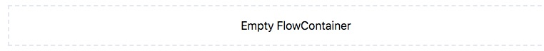

# FlowContainer Component

The Flow Container is a layout component that allows you to select from a set of components, 
place them on the page, and resize them. The Flow Container is  defined by page templates. 
These templates are created by a developer and define the spaces available to add content 
(components).

## Content Editor Details

When an empty Flow Container is on the page you will only see a box bounded by dotted line.




### Add a new component


When you activate a Flow Container you will be able to add a new component to the Flow 
Container via the Component Library.

By clicking on the component selector button you can scroll through all of the available 
components. You can filter the components by:

* Using search facets to filter out components that do not match the selection 
(you can undo this by clicking the "select all" checkbox at the top).
* Using the search box field to search across all of the component titles.

You can hover over the infomation icon to see a description of the component.

When you have found the right component, simply click on it, and it will be
added at the end of the activated flowContainer.

### Removing a component

When any component in the flowContainer is active it will provide a delete button to the 
context menu. Clicking on this icon will remove the component.

### Resizing a component

When any component in the flowContainer is active it will appear with a blue
border. You can resize the component by clicking on the right edge of the
border. 
?> Note: this can be done at different breakpoints to adjust the size of
the component at that breakpoint and above. Therefore, if you want a component to 
be a specific size at a certain breakpoint you will have to resize the editor to 
that breakpoint and resize the component again. 

The sizes are finite and defined by the creator of that particular flowContainer.
Smaller breakpoints will offer fewer options for resizing.

### Reordering a component

When any component in the flowContainer is active it will appear with a blue
double line icon in the top left corner of the component. By clicking and
dragging this icon you can reorder components in the flowContainer.

### Replacing a Component

To replace a component, use the swap button from the toolbar. It will replace the component 
without losing data (as long as the data is applicable in the replacement component). 
You can also replace a component by deleting it and adding a new component in its place
via the add button on the toolbar. 

---

## Site Builder Details

### Adding components to the FlowContainer

The FlowContainer uses the Design API to collect the components to make available 
for placement:

``` js
import { FlowContainer } from '@bodiless/layouts-ui";

design = {
    Card: flow(startWith(Card), asDefaultCard),
    CardVertical: flow(startWith(Card), asVerticalCard, asDefaultCard),
  }
const SiteFlowContainer = withDesign(design)(FlowContainer);
```

Use the `startWith` HOC to declare the base component and 
then use any other hoc that will add to this specific version.

> Note that we import the flow container from `@bodiless/layouts-ui`, not
> directlly from `@bodiless/layouts`.  All Bodiless components which
> have a content-editor facing UI have a corresponding UI package
> which defines the look and feel of that UI.

### Metadata and Component Selector Filters

The facets and terms of the search filters which appear in the component selector
are defined by metadata attached to the components.  Each component aggregates
the metadata attached to all the tokens which have been applied to the
component:

```js
const asBlueCard = asToken({
  withDesign({ Wrapper: withBlueBorder }),
  asToken.meta.term('Color')('Blue'),
});
const asRedCard = asToken({
  withDesign({ Wrapper: withRedBorder }),
  asToken.meta.term('Color')('Red'),
});
const ColoredCardsFC = withDesign({
  BlueCard: asToken(startWith(Card), asDefaultCard, asBlueCard),
  RedCard: asToken(startWith(Card), asDefaultCard, asRedCard),
})(FlowContainer);
```
The above will cause the component selector to display a "Color" filter
with checkboxes for "Red" and "Blue".

#### Mandatory Categories
To reduce visual noise, the component selector will only display filters for
categories in which all the currently filtered components have at least one
term. For example:

```js
const ColoredCardsFC = withDesign({
  PlainCard: asToken(startWith(Card), asDefaultCard),
  BlueCard: asToken(startWith(Card), asDefaultCard, asBlueCard),
  RedCard: asToken(startWith(Card), asDefaultCard, asRedCard),
})(FlowContainer);
```

will not display the Color filter by default unless the `PlainCard`
is filtered out (for example by a text search).

To force a category to appear, you can specify it using the `mandatoryCategories`
prop to the flow container:
```js
const FCWithMandatoryColorFilter = addProps({ mandatoryCategories: ['Color'] })(FlowContainer);
```

#### Blacklisted Categories
Depending on the kind of metadata you attach to tokens, it may be desirable
to exclude certain categories from appearing.  This can be done via the
`blacklistCategories` prop:
```js
const asBlueCard = asToken({
  withDesign({ Wrapper: withBlueBorder }),
  asToken.meta.term('Color')('Blue'),
  asToken.meta.term('Design System')('JnJ'),
});
const FCWithBlacklistedCategory = asToken(
  withDesign({
    BlueCard: asToken(startWith(Card), asDefaultCard, asBlueCard),
  }),
  addProps({ blacklistCateogries: ['Design System'] }),
)(FlowContainer);
```
Only the "Color" filter will be displayed (not the "Design System" filter).

#### Other metadata
In addition to categories, compnents can have `title` and a `description`
properties. These are used to provide more information about the component
to the editor, and for searching.
```js
const ColoredCardsFC = withDesign({
  PlainCard: asToken(startWith(Card), asDefaultCard, { title: 'Card with no color' }),
  BlueCard: asToken(startWith(Card), asDefaultCard, asBlueCard, { title: 'Blue Card' }),
  RedCard: asToken(startWith(Card), asDefaultCard, asRedCard, { title: 'Red Card; }),
})(FlowContainer);
```

Often an explicit title is not necessary, and `@bodiless/layouts` provides
a helper token which causes all the components in the flow container
to receive a default title based on their metadata:
```js
const ColoredCardsFCWithDefaultTitles = asToken({
  withDesign({
    PlainCard: asToken(startWith(Card), asDefaultCard),
    BlueCard: asToken(startWith(Card), asDefaultCard, asBlueCard),
    RedCard: asToken(startWith(Card), asDefaultCard, asRedCard),
  }),
  withAllTitlesFromTerms({ blacklistCategories: ['Design System'] }),
})(FlowContainer);
```
The default title will only be applied if the component does not have
an explicit title.

### Using `varyDesign`

If you have a component with many variations which you want to make
available in a flow container, it can be tiresome to list them all in
a design, eg:
```js
const FCWithManyCardVariations = withDesign({
  BlueRoundedHorizontalCard = asToken(startWith(Card), asDefaultCard, asBlueCard, asRoundedCard, asHorizontalCard),
  BlueRoundedVerticalCard = asToken(startWith(Card), asDefaultCard, asBlueCard, asRoundedCard, asVerticalCard),
  BlueSquareHorizontalCard = asToken(startWith(Card), asDefaultCard, asBlueCard, asHorizontalCard),
  BlueSquareVerticalCard = asToken(startWith(Card), asDefaultCard, asBlueCard, asVerticalCard),
  ...
})(FlowContainer);
```
To simplify this process, you can use the
[`varyDesign`](../../Development/Architecture/FClasses#design-variants)
function exported from `@bodiless/fclasses`.

### Constraining Component Widths

The Flow Container controls the width of components by setting different classes
on their wrapper component. The Flow Container uses a set of tailwind width
classes by default. These set the available widths to 1/4, 1/3, 1/2, 2/3, 3/4
and full for all viewport sizes except "small", and to full only for small
viewports.

If you are using tailwind, the easiest way to define a new set of width
constraints is using the `withTailwindWidthConstraints` helper. You pass it your
fully resolved tailwind configuration, and it returns a function which accepts a
list of tailwind width classes and returns a token which constrains flow
container items to those widths:
```js
import rewolveConfig from 'tailwindcss/resolveconfig';
import tailwindConfig from './path/to/your/tailwind.config';

const withWidthConstraints = flow(
  resolveConfig,
  withTailwindWidthConstraints,
)(tailwindConfig);

const ConstrainedFlowContainer = withWidthConstraints('lg:w-1/2 lg:w-full')(FlowContainer);
```
Note that we specify our constraints with a responsive prefix. The flow container will
apply these constraints only at the specified viewport size. Tailwind is "mobile first",
so to change the constraints at the smallest viewports, we would use no prefix:

```js
withWidthConstraints('w-1/2 w-full lg:w-1/3 lg:w-1/4 lg:w-1/2 lg:w-2/3 lg:w-3/4 lg:w-full');
```

#### Advanced usage
The `snapData` prop allows the user to provide a function that can set any set of classes.
This function should take an object with a className property (which is a string of the
current classes) and a width property. It then returns an object with a className property
(an updated version of the className) and a width property (the width to which it should snap). 
Both width properties are expressed in percentages (e.g. 50%, 75%).

#### Helper functions for snapData

There are two helper functions for `snapData`.

* **`withTailwindClasses`**: takes a tailwind configuration and the classes in that 
configuration you would like to use. It returns a snapData function using the data from 
the tailwind config.

   ``` js
   import tailwindConfig from '../tailwind.config';

   const snapData = withtailwindClasses(tailwindConfig)('w-full, md:w-full, md:w-1/2, lg:w-full, lg:w-1/2, lg:w-1/3, lg:w-1/4');
   ```
     ---

* **`getSnapFrom`**: can be used with `withTuple` to create a snapData as well. 
Each `withTuple` takes a mediaQuery at which it is active, a width to which it 
corresponds and a class to used.

  ``` js
  const defaultSnapData = getSnapFrom(
    withTuple('(min-width: 0px)')(100)('w-full'),
    withTuple('(min-width: 576px)')(50)('sm:w-1/2'),
    withTuple('(min-width: 576px)')(100)('sm:w-full'),
    withTuple('(min-width: 992px)')(25)('lg:w-1/4'),
    withTuple('(min-width: 992px)')(33.33)('lg:w-1/3'),
    withTuple('(min-width: 992px)')(50)('lg:w-1/2'),
    withTuple('(min-width: 992px)')(66.66)('lg:w-2/3'),
    withTuple('(min-width: 992px)')(75)('lg:w-3/4'),
    withTuple('(min-width: 992px)')(100)('lg:w-full'),
  );
  ```

---

#### Default Width

One can set the default width classes via the `getDefaultWidth` prop. The prop
is a function that will be passed the snapData function. It is expected to
return a string of the starting classes

example:

```js
const FlowContainerWithDefaultWidth = addProps({
  getDefaultWidth: () => 'w-full lg:w-1/4',
})(FlowContainer);
```

### Limit Number of Components

**`maxComponents`** will limit the number of components that can be added to the
Flow Container. If the number of components equals the value of maxComponents
then the add button will not be visible. If a component is removed and the
number of components is less than the max value then the add button will
reappear.

**`minComponents`** will limit the number of componetns that can be removed from
th Flow Container. If the number of components is less than or equal to the
value of minComponents then the delete button will not be visible.

### Component Selector Preview
The component selector displays a preview of each component to help the
content editor understand what she is selecting.  By default, this is
simply a scaled version of the original component. In some cases, it may
be desirable to render a custom preview (for example, the actual rich text
component is just an empty box, so instead we render its format bar as
a preview).

To facilitate custom previews, the flow container provides a React context
informing each component whether it is being rendered in the component
selector or on the actual page.  A component can use this to change the
way it renders in each context.  For example:
```js
import { ifComponentSelector } from '@bodiless/layouts';

const withCustomPreview = ifComponentSelector(
  addProps({ children: 'this is a preview' }),
  addClasses('text-center italic'),
);

const variations = varyDesigns<any>(
  base,
  borders,
  colors,
  { '': withCustomPreview },
);
```
Here, `ifComponentSelector` consumes the context provided by the flow ontainer
and provides a
[flow toggle](../../Development/Architecture/FClasses#flow-toggles) which
applies a set of tokens only if the component is being rendered as a preview
inside the component selector.

Note how we applied `withCustomPreview` to all variations by adding a
design with a single key to the list of designs provided to `varyDesigns`.
Because there is only one key which is being applied to all variations, we
can use an empty string.
