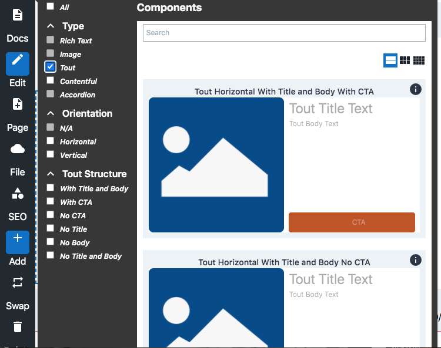
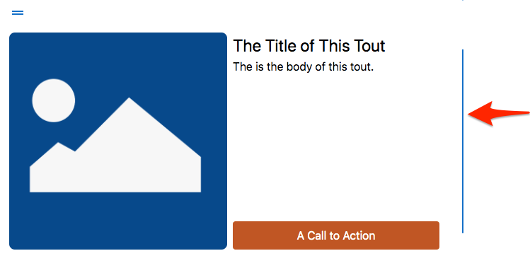
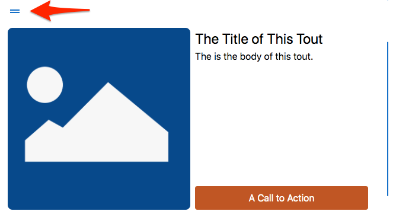

# Tout Component

Tout, sometimes called a taco or a tile or a card,  is a group of content which 
typically features a less than full size image alongside supporting 
content or a call to action (CTA). Touts are commonly used on websites to 
call out or offer something to the site visitor. The tout component allows
site builders to configure and modify touts according to the site design.

Basic touts usually consist of some or all of the following components:
* **Title:** Text editable via simple text editor.
* **Image:** Image component - linkable or not linkable.
* **Description:** Text editable via basic text
editor.
* **CTA Button:** Text editable via simple text editor. Link component
to configure link.

## Content Editor Details

BodilessJS by default offers basic layout options for both vertical and
horizontal tout. For both horizontal and vertical options you can choose to
include the following: title, body text, CTA.

To place a tout on your website click on the +Add button on the toolbar.

1. Select the type of tout you'd like to use. You can use the filters in the
component window to narrow your selection.  


2. Once you have selected the appropriate tout you can edit the various
components via the context menu.
    * e.g. For a horizontal Tout with Title, Body and CTA

3. Resize the tout by clicking near the blue line on the righthand edge of the
flow container box and dragging to expand or contract.


5. Re-position the tout on the page by clicking near the two lines at the top
left of the tout's flow container box and dragging to the desired place on your
page.  


---

## Site Builder Details

### Tout Variations with combining tokens

The tout can be composed of different tokens (see
[code](../../../packages/bodiless-organisms/src/components/Touts.tokens.tsx)) to
create many tout variations. These variations include:

* Horizontal 
* Vertical 
* No Title, 
* No Body 
* No description 
* No CTA 
* Overlay of CTA 
* Overlay of title

### Usage

```
const ToutVerticalNoTitle = flow(
  asToutWithPaddings, asToutDefaultStyle, asToutVertical, asToutNoTitle,
)(Tout); 
```

---

## Architectural Details

The Tout renders as a block of html with the following:

```
    <Wrapper {...rest}>
      <ImageWrapper>
        <ImageLink>
          <Image />
        </ImageLink>
      </ImageWrapper> <ContentWrapper>
        <Title /> <Body /> <Link />
      </ContentWrapper>
    </Wrapper>
```    
