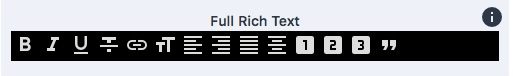

# Rich Text Editor Component

The Rich Text Editor allows you to easily add text content to your site. By
default there are three options for the Rich Text Editor: Simple, Basic, and
Full. The Rich Text Editor is also a sub component of many higher order components. 
You can add text to a page on your site via the editor component or you
can add a component or components that contain text, which make use of the
editor (e.g. Tout, Accordion, etc).

## Content Editor Details

| Simple | Basic | Full | 
| -------|-------|------| 
| |  |  | 
|The Simple Rich Text Editor offers the following formatting options: Superscript | Basic Rich Text Editor offers the following formatting options: bold, italic, underline, link, left alignment, right alignment, center alignment, justification alignment, superscript | The Full Rich Text Editor offers the following formatting options: bold, italic, underline, link, left alignment, right alignment, center alignment, justification alignment, superscript, header |

?> Please note that the above configurations are examples of the default options.
The site requirements and site builder will determine which rich text editor
options are available, where they are available to the editor, and which options
are available for each variation.

## Site Builder Details

> Note this document describes the low-level API of Bodiless's rich text editing support. 
> A new high level API is under active development.

Bodiless RichText provides a Rich Text Component that allows content uses to edit and manipulate text. 
This package also includes a set of tools for elegant scaffolding and extending Slate editor.
> Before using this module it is essential to understand how Slate editor works: 
**[Read Slate Walkthroughs and Guides sections](https://docs.slatejs.org/).** 


## Architectural Details

### Contents

1. **Exports**
   - [Slate Editor Component](#slateeditor) 
   - [Content Component](#slatecontent)
   - [SlateContext Component](#slateeditorcontext)
   - [Hover Menu Component](#hovermenu)
   - [RichText Items](#rich-text-items)
   
2. **Plugin Factories**
   - [Mark Factory](#mark-factory)
   - [Inline Factory](#inline-factory)
   - [Block Factory](#block-factory)
   
3. **APIs**
  - [Node Component API](#node-component-api)
  - [Node Form API](#node-form-api)
  
4. **Guides**
   - [How to create mark plugin](#creating-mark-plugin)
   - [How to creat inline plugin. ](#creating-inline-plugin)
   - [TBD] Creating a block plugin
   
5. **[Roadmap](#roadmap)**

### Exports

<a name="slateeditor"></a>
#### Slate Editor Component - `<SlateEditor />`
`<SlateEditor>` - Main Content controller component that provides react context with 
editor related data and callbacks to nested components. Expects `<SlateEditor>` as one
of its direct children to obtain editor reference.

**Basic usage:**

```js
import { SlateEditor, Content } from '@bodiless/richtext/core';

function MyEditor() {
  return (<SlateEditor>
    <Content />
  </SlateEditor>);
}
```

**Properties:** 

|Name   | type | Default value   | Description   |
|---|---|---|---|
|`initialValue`   | object | `{document: {...}}`  |Initial value of the editor that will be used on editor mount.|
|`style` | object | `{}` | Inline styles to be applied to the wrapping `<div />`|
|`className`   | string | `""`  | Class name to be applied to the wrapping `<div />`|
|`plugins`   | [Plugin](https://docs.slatejs.org/slate-core/plugins)[] | `[]`  | An array of [slate editor native plugins](https://docs.slatejs.org/slate-core/plugins) to be applied to the editor instance on initialization. |
|`value`   | [Value](https://docs.slatejs.org/slate-core/value) | Generated from `Value.fromJSON( initialValue )`    | [Read official reference](https://docs.slatejs.org/slate-core/editor#value). <br/><br/>A Value object representing the current value of the editor. Prop `value` takes priority over `initialValue` prop and internal `value` state. |
|`onChange`   | `onChange(editor)`  | `(editor) => {}`  | [Read official reference](https://docs.slatejs.org/slate-core/editor#onchange). <br/><br/> A change handler that will be called with the `change` that applied the change. This hook allows you to add persistence logic to your editor.
|`children`   |  any | **required**  | Components listed as children will have access to the Content Context. `<SlateEditor>` requires `<Content>` to be an immediate children.

<a name="slatecontent"></a>
### Content Component - `<Content />` 
`<Content>` - Wrapper around [`<Content />`](https://docs.slatejs.org/slate-react/editor) which is the main editorial area. 
`<Content>` wraps Content with a `<div />` and supplies values from Content Context to [`<Content />`](https://docs.slatejs.org/slate-react/editor).

**Basic usage:**

```js
import { SlateEditor, Content } from '@bodiless/richtext/core';

function MyEditor() {
  return (<SlateEditor>
    <Content 
      className='editor' 
      wrapperStyle={{ opacity: '0.5'}}
      spellCheck
      placeholder='Type here...' 
    />
  </SlateEditor>);
}
```

**Properties:** 

[See original reference for `<Content />` props](https://docs.slatejs.org/slate-react/editor#props)

|Name   | type | Default value   | Description   |
|---|---|---|---|
|`wrapperStyle` | object | `{}` | Inline styles to be applied to the wrapping `<div />`|
|`className`   | string | `""`  | Class name to be applied to the wrapping `<div />`|

<a name="slateeditorcontext"></a>
### SlateContext Component
`SlateContext` - an object with editor related data to be used in nested components.

**Basic usage:**

```js
import React, { useContext } from 'react';
import { SlateEditor, Content, SlateContext } from '@bodiless/richtext/core';

function Toolbar() {
  const {value, editor } = useContext(SlateContext);
  
  // obtain value properties to manipulate Toolbar look...
  const { fragment, selection } = value;
  if (selection.isBlurred || selection.isCollapsed || fragment.text === '') {
    console.log('No text is selected');
  }
  
  // perform updates using editor...
  function moveFocusForward(chars) {
    editor.command((editor) => {
      editor.moveFocusForward(chars);
    })
  }
  
  return (<div>
    <button onMouseDown={() => moveFocusForward(5)}>Move focus forward by 5</button>
  </div>)

} 

function MyEditor() {
  return (<SlateEditor>
    <Toolbar />
    <Content />
  </SlateEditor>);
}
```

**Properties:** 

|Name   | Type | Description   |
|---|---|---|
|`editor`   | [Content](https://docs.slatejs.org/slate-react/editor)   | [Read official reference](https://docs.slatejs.org/slate-react/editor). <br/><br/> Initial value of the editor that will be used on editor mount.|
|`value`   | [Value](https://docs.slatejs.org/slate-core/value) | [Read official reference](https://docs.slatejs.org/slate-core/editor#value). <br/><br/>A Value object representing the current value of the editor. Prop `value` takes priority over `initialValue` prop and internal `value` state. |

<a name="hovermenu"></a>
### Hover Menu Component - `<HoverMenu />`
`<HoverMenu />` - a hover menu that appears on any selection within editor. 
`<HoverMenu />` passes values of `SlateContext` to all its children as props.

**Basic usage:**
```js
import React from "react";
import { SlateEditor, Content, HoverMenu } from "@bodiless/richtext/core";

const Content = (props) => {
  return (
    <SlateEditor {...props} plugins={plugins} >

      <HoverMenu>
        <BoldButton />
        <ItalicButton />
      </HoverMenu>

      <Content />
    </SlateEditor>
  );
};

export default Content;
```

<a name="rich-text-items"></a>

#### RichText Component

The RichText Component is built on the [SlateJS](https://docs.slatejs.org/) framework. It takes design object 
(see @bodiless/Design System) that contain HOC to build out the component that are 
avaiable in the RichText Editor. Those are then presented to the user using both a 
contextual hover menu as well as the standard menu. These items can be used by using 
a set of HOC's. 

`starWith(Component)` lets us know which component should be part of the item

`asMark`, `asInline` and `asBlock` are used to say how the slate editor should use the component.

- `marks` are used for basic character-level formatting (eg bold, italic, underline, text=color, etc).
- `inlines` may also be used for character formatting, but should generally be reserved for cases 
where the component requires additional configuration besides the text (for example, a link, 
which may require `href`, `target` or other attributes).
- `blocks` should be used for block-level formatting (eg headers, lists, etc).

`withKey("k")` can be used to add a shortcut key to the component.

`withButton("icon")` can be used to add a button that will set the text to a component. 
If the item is asBlock then it will be added to the global menu if not then it will be added 
to the local hover menu.

There are a set of keys that have defaults that are often used they are the following:

- SuperScript
- Bold
- Italic
- Underline
- Link
- AlignLeft
- AlignRight
- AlignCenter
- AlignJustify
- H1
- H2
- H3

With these one only need to include the key.

Each of this helper return a function that we pass in as items. We can use flow to 
combine them as such:

```js
const design = {
  Bold: asBold,
  Link: asLink,
  Strikethrough: flow(
    startWith(Span),
    withButton('format_strikethrough'),
    withKey('s'),
    asMark,
  ),
};
const EditorFullFeatured = <P extends object> (props:P) => (
  <RichText design={items2} initialValue={demoValue} {...props} />
);
```

### Plugin Factories

In order to minify boilerplate creating a slate plugin `@bodiless/richtext` provides factories. 
Plugin types are mimicking [Slate data model](https://docs.slatejs.org/guides/data-model). 
There are 3 types of plugins that can be created:
- **Mark plugin** - renders provided component wrapping a piece of text. Doesn't have any 
data and component is togglable.
- **Inline plugin** - acts as a mark, but has data and a way to control it. You can 
provide a Form component that implements [Form API](#using-form-api) along with the component, 
and plugin with handle the data updates and rendering of both Component and Form.
- **Block plugin** - TBD

<a name="mark-factory"></a>
#### Mark Plugin Factory
Mark plugin factory reduces boilerplate required to create a plugin to render custom marks in 
Slate editor. Also, you can generate a button that is going to trigger the mark on and off.

**Exports:**
- createMarkButton(markType: string, materialIcon: string): React.ComponentType
    - **_markType_**: string - a unique string to identify mark component. 
    Should match _markType_ value of the corresponding mark plugin.
    - **_materialIcon_**: string - a string that is converted into a [Material Icon](https://material.io/tools/icons/?style=baseline) glyph

- createMarkPlugin(MarkComponent: Mark, markType: string, options: MarkPluginOptions): [Hooks](https://docs.slatejs.org/slate-react/plugins#hooks)
    - **_MarkComponent_**: MarkComponent - mark component that is going to be rendered to represent mark occurrences. 
    Should match _markType_ value of the corresponding mark button.
    - **_markType_**: string - a unique string to identify mark component. Should match _markType_ value of the corresponding mark button.
    - **_options_**: MarkPluginOptions - options object to provide additional plugin configuration. Acceptable options:
        - **_keyboardKey_**: string - a keyboard key to trigger the mark. Make sure the provided key is not used in any other plugins.

<a name="inline-factory"></a>
### Inline Plugin Factory
Inline plugin factory reduces boilerplate required to create a plugin to render
custom inline nodes in Slate editor. You can generate a button for an inline
node like for marks. Also, in addition, you can provide a custom form for each
inline node to manage its data.

**Exports:**
- createInlineButton(inlineType: string, materialIcon: string): React.ComponentType
    - **_inlineType_**: string - a unique string to identify inline node component. 
    Should match _inlineType_ value of the corresponding inline plugin.
    - **_materialIcon_**: string - a string that is converted into a [Material Icon](https://material.io/tools/icons/?style=baseline) glyph


<a name="block-factory"></a>
### Block Plugin Factory
Block plugin factory reduces boilerplate required to create a plugin to render custom 
block nodes in Slate editor. You can generate a button for block node like for marks. 

**Exports:**
- createBlockButton(inlineType: string, materialIcon: string): React.ComponentType
    - **_inlineType_**: string - a unique string to identify inline node component. 
    Should match _inlineType_ value of the corresponding block plugin.
    - **_materialIcon_**: string - a string that is converted into a [Material Icon](https://material.io/tools/icons/?style=baseline) glyph


### APIs

<a name="node-component-api"></a>
#### Node Component API

Inline plugin factory generates a wrapper around provided Component. 

**NodeComponent Properties:**

|Name   | Type | Description   |
|---|---|---|
|`data`   | object   | Current slate node `data`
|`setData`   | setData(newData: object): void | Sets the data for current slate node
|`unwrap`   | unwrap(): void | Remove current slate node from the editor

**Example:**
```js

function InlineComponent({data, setData, unwrap}) {
  return <span>...</span>
}
```
<a name="node-form-api"></a>
**NodeForm Properties:**

|Name   | Type | Description   |
|---|---|---|
|`data`   | object   | Current slate node `data`
|`setData`   | setData(newData: object): void | Sets the data for current slate node
|`closeForm`   | closeForm(): void | Upon calling closes the form
|`unwrap`   | unwrap(): void | Remove current slate node from the editor

**Example:**
```js

function FormComponent({data, setData, closeForm, unwrap}) {
  return <form>...</form>
}

```

[See Using Form API Guide](#using-form-api) 

### Guides 

<a name="creating-mark-plugin"></a>
#### Creating mark plugin
Mark is a simple wrapper for a specific piece of text in the editor. Marks are the 
simplest entities of Slate Content and can be only triggered on and off and stack
with other marks.
 
**Mark Plugin Factory usage:**
```js
import React from 'react';
import { createMarkButton, createMarkPlugin } from '@bodiless/richtext/plugin-factory';

function CustomMark({children}) {
  return (<span className="custom-mark">{children}</span>);
}
const MARK_TYPE = 'custom_mark';
// trigger mark by pressing ctrl+'m' or alt+'m'
const KEYBOARD_KEY = 'm'; 
const CustomMarkPlugin = createMarkPlugin(CustomMark, MARK_TYPE, { keyboardKey: KEYBOARD_KEY });
const CustomMarkButton = createMarkButton(MARK_TYPE, 'format_underline');

export {
  CustomMarkButton,
  CustomMarkPlugin
};
```

<a name="creating-inline-plugin"></a>
#### Creating Inline Plugin 

Inline nodes are more complex entities of the slate editor and can contain data. 
That's why inline can have an optional form and inline component has a way of updating 
itself data using `setData()` prop.  Inline Form API can be used to render edit form
in a tooltip around the inline node, however, it's not mandatory. 

**Using Form API:** 
```js
import React, { useState } from 'react';
import { createInlineButton, createInlinePlugin } from '@bodiless/richtext/plugin-factory';

function LinkForm({setData, closeForm, unwrap, data}) {
    const [href, setHref] = useState(data.href);
  
    return <form onSubmit={(newData) => {
      setData(newData);
      closeForm();
    }}>
        <input value={href} onChange={event => setHref(event.target.value)}/>
        <button type="submit">Save</button>
        <button type="button" onMouseDown={() => {
            if (href) {
              closeForm();
            } else {
              unwrap();
            }
        }}>Cancel</button>
        <button type="button" onMouseDown={unwrap}>Remove</button>
    </form>
}

function Link({data, children, setData, unwrap}) {
  return <a {...data}>{children}</a>;
}
//
// External
//
const INLINE_TYPE = 'link';
const ImagePlugin = (options = {}) => {
  return createInlinePlugin(Link, INLINE_TYPE, {Form: LinkForm});
};
const LinkButton = createInlineButton(INLINE_TYPE, 'link');

export {
  ImagePlugin,
  LinkButton,
};
```

**Create Link Plugin using Inline Plugin Factory without Form API:** 
```js
import React, { useState } from 'react';
import { createInlineButton } from '@bodiless/richtext/plugin-factory';
import Tooltip from 'rc-tooltip';

function Link({data, children, setData}) {
    const [formActive, setFormActive] = useState(false);
  
    return <Tooltip
      visible={formActive}
      onClick={() => setFormActive(true)}
      overlay={() => {
          const [href, setHref] = useState(data.href);
          return <form onSubmit={(newData) => {
              setData(newData);
              setFormActive(false);
          }}>
              <input value={href} onChange={event => setHref(event.target.value)}/>
              <button type="submit">Save</button>
              <button type="button" onMouseDown={() => {
                 setFormActive(false);
              }}>Cancel</button>
          </form>  
      }}
    >
      <a {...data}>{children}</a>
    </Tooltip>;
}
//
// External
//
const INLINE_TYPE = 'link';
const ImagePlugin = (options = {}) => {
  return createInlinePlugin(Link, INLINE_TYPE, options);
};
const LinkButton = createInlineButton(INLINE_TYPE, 'link');

export {
  ImagePlugin,
  LinkButton,
};
```

<a name="roadmap"></a>
### Roadmap

-[ ] Create block factory
-[ ] Write Unit Tests

