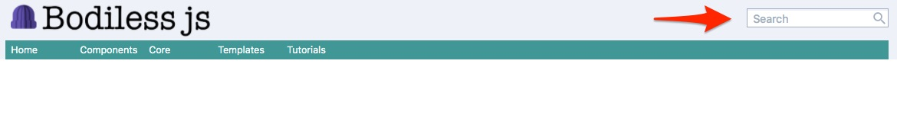

# Search Component

The BodilessJS Search component provides a search box which allows users to
search for site content. It also provides search results components to display
results on a designated search page.



?> The BodilessJS Search Component requires search index to be built prior to
searching. The Search Component is intended for use in a static environment
(i.e. not an edit environment). In the edit environment, search may work locally
but the search index may be out of date. For example if you add a new page on a
site in edit mode, the search will not find the new page until you perform a
build.  If your site is deployed where the static and edit environments are
separate (e.g. sites deployed on platform.sh), the site search index may not be
available in edit mode and search results will not be returned.

## Content Editor Details

?> The Search Component needs to be added to the site by the Site Builder. While
the Content Editor cannot control placement for the search box, they can set the
SEO meta data for the search results page. Depending on site implementation, the
content on the search page may be editable. Contact a developer to assist with
adding the Search Component to your site.

---

## Site Builder Details

The BodilessJS Search component provides full-text client-side search for
Bodiless sites. By default, it uses [Lunr](https://lunrjs.com/) search library
for creating the index - a stored file of searchable content - while performing
the search behind the scenes on client side.  A local search index will be
quicker than using a server side service as there is no network overhead, and
will remain available and usable even without a network connection.


### 1. Installation

Install the Bodiless search package:

```
npm install @bodiless/search
```


### 2. Set Up Search Configuration in Env File

To enable the search on a site, the site builder needs to add search
configurations inside the environment setting file. 

#### Configuration

Set the following configuration options in `.env.site` based on search
requirement.

```
# .env.site

## This is the URL path of the search results landing page. 
## When you create this page, you must use this same page path when you
## perform step 6 - 
## "Add search results pages..."
BODILESS_SEARCH_PAGE='search'

## Set in-browser search index expiration time period in seconds. 
## By default, the index expires in one hour (86400 seconds) from time of load.
BODILESS_SEARCH_EXPIRES='86400'

## Where index file is located, used by index generating script. 
## ./public is the recommended path where gatsby builds the static site.  
BODILESS_SEARCH_SOURCE_PATH='./public'

## CSS selectors used to specify the content elements for indexing. 
## This allows you to define class selectors to exclude indexing that content. 
## Recommend adding menus or other global items in header and footer.
BODILESS_SEARCH_INDEX_SELECTOR='body *'

## CSS selectors used to exclude content element from indexing.
BODILESS_SEARCH_INDEX_EXCLUDE_SELECTOR='script,noscript,style,.bg-gray-200,h1'

## Number of charactors displayed in preview section.
BODILESS_SEARCH_INDEX_PREVIEW_LENGTH='300'
```

### 3. Support Search Indexing

In this step, you will update `package.json` to build the search index. In
addition, you will add search index command that you can run on demand. A search
index command will be added to build step as well so that it is updated
automatically on every build.

_Make the following changes (Steps 3a, 3b, 3c) in the `scripts` section of `package.json`._

#### 3a. Create a `search-index` task

```
"search-index": "create-search-index"
```

#### 3b. Add `build:search`

```
"build:search": "npm run search-index"
```

#### 3c: Add `build:search` step to the build task.

```
"build": "npm-run-all build:env-vars build:lib build:doc build:search",
```

#### Usage of Building Search Index

To manually run and build the search index, you can do the following command,
otherwise it will be automatically created on every npm run build (_see step 3c
above_):

```
npm run search-index
```

This will create the search index under path specified by
`BODILESS_SEARCH_INDEX_PATH` from configuration.

### 4. Create Search HOCs

Create the search HOC functions, which will add and define the styles for search
comopnents.

Under site project root, add a new folder as `src/component/Search` for site level
search components. Then create search related component files under this folder.
In this example, create:

```
src/component/Search/index.tsx
```

There are two search components are required to provide search function from
Bodiless Search package, namely `SearchBox` and `SearchResult`. Site builder can
import them and apply custom styling.

```
import { flow } from 'lodash';
import { SearchBox as SearchBoxClean, SearchResult as SearchResultClean } 
  from '@bodiless/search';
import {
  asSimpleSearchResult, asInlineSearch, asSimpleSearch,
} from './token';

export const SimpleSearchResult = flow(asSimpleSearchResult)(SearchResultClean);
export const InlineSearchBox = flow(asInlineSearch)(SearchBoxClean);
export const SimpleSearchBox = flow(asSimpleSearch)(SearchBoxClean);
```

The "SearchClean" alias given to imported components is a Bodiless convention
for unstyled package components. Site builder will need to format them before
adding to pages.

For how to add design to clean components, please refer to the [Bodiless Design System](https://johnsonandjohnson.github.io/Bodiless-JS/#/Design/DesignSystem) documentation.

Here's a quick example of applying design to `SearchBox` and `SearchResult`:
```
// src/components/Search/index.tsx

/**
* Search box component is composed of 3 subcomponents, they can be styled 
* individually.
*/ 
const searchBoxDesign = {
  SearchWrapper: addClasses('my-4 border bl-border-black align-middle'),
  SearchBox: addClasses('px-2 align-middle text-1xl'),
  SearchButton: withIcon('search'),
};

/**
* Search result list item subcomponent is also composed of 3 subcomponents, 
* they can be formatted with nested designs.
*/ 
const searchResultDesign = {
  SearchResultWrapper: addClasses('py-2'),
  SearchResultList: addClasses('py-2'),
  SearchResultSummary: addClasses('text-sm italic'),
  SearchResultListItem: withDesign({
    ItemAnchor: addClasses('my-4 bl-text-blue-500 underline'),
    ItemParagraph: addClasses('text-sm'),
    ItemList: addClasses('my-4'),
  }),
};

const asSimpleSearch = withDesign(searchBoxDesign);
const asSimpleSearchResult = withDesign(searchResultDesign);

export const SimpleSearchBox = flow(asSimpleSearch)(SearchClean);
export const SearchResult = flow(
  asSimpleSearchResult,
)(SearchResultClean);

```

Here, `SimpleSearchBox` and `SimpleSearchResult` are exported as site level
components for search rendering. 

### 5. Placing the Search Box

The search box is often found in a site's header. This example will add the
search box to your site's header. It is possible to add the search box onto any
page/template as well. For example, to display the search box on page header,
`SimpleSearchBox` can be added to `src/components/Layout/header.tsx`,

```
// ...

const HeaderClean: FC<Props> = ({ components }) => {
  const {
    Wrapper,
    Container,
    MenuContainer,
    Menu,
    SiteLogoReturn,
  } = components;

  return (
    <Wrapper>
      <Container>
        <SiteLogoReturn />
        <SimpleSearchBox placeholder="Search" />
      </Container>
      <MenuContainer>
        <Menu />
      </MenuContainer>
    </Wrapper>
  );
};
```

?> The search placeholder can be changed to meet site requirements and translations.

### 6. Add Search Results page using the SimpleSearchResult component

To add `SimpleSearchResult` component, import `withSearchResult` HOC, which can
add `SearchResultProvider` context provider to a container component on the
page, i.e.

```
const PrimaryHeader = flow(
  withEditorBasic('title', 'Title'),
  asHeader1,
  addClasses('py-4'),
)(H1);


const myEmptyMessage = "Tu búsqueda no arrojó resultados";
const myCountMessage = "Demostración %count% Resultados";

const SearchPage = (props: any) => (
  <Page {...props}>
    <SearchLayout>
      <PrimaryHeader/>
      <InlineSearchBox />
        <SimpleSearchResult
          resultCountMessage={myCountMessage}
          resultEmptyMessage={myEmptyMessage}
        />
    </SearchLayout>
  </Page>
);
```

?> `resultCountmessage` & `resultEmptyMessage` defaults to const 
`ResultCountMessage = 'Showing %count% result(s).';`
`defaultResultEmptyMessage = 'No content matches your request, please enter new keywords.';`

?> These can be overwritten by specifying your own string. When placing the
search result component and strings utilize the count token (%count%) which
substitutes a value of search results found.


> Note: for complete search component implementation example, please check 
[Test-Site/Search Component](https://github.com/johnsonandjohnson/Bodiless-JS/blob/master/examples/test-site/src/components/Search/index.tsx).

### Site Build Troubleshooting Guide.

The site search index is cached in your browser cache so if you make changes, they
may not take effect.
To clear the search index cache go to your Developer Tools in your browser (e.g.
Chrome)
1. Click Application tab
2. Click Local Storage and your site
3. Then clear search:index file.

### Defining What is Indexed

Indexing on your site is defined by the `BODILESS_SEARCH_INDEX_SELECTOR` env
variable. It is recommended that you set it to the body of your content or body
of your articles. It accepts classes or ids or other selectors and is comma
separated. If you want to index all items in the body of your page use "body *"
and all content within body will be indexed.

For example, if you want to index article content, you can use ".article-content *" 
and target article content specifically.

In addition, you can exclude items from search via the env var `BODILESS_SEARCH_INDEX_EXCLUDE_SELECTOR`.
By default we suggest adding `script`, `noscript`, `style` so these aren't indexed. 

#### Adding a `no-search` Class

Using a `no-search` HOC around anything you do not want indexed is very useful.```

**Example:**

Build a HOC component that can be used to wrap any content/components.

```
type Props = DesignableComponentsProps<NoSearchComponents> & HTMLProps<HTMLElement>;

const noSearchComponents:NoSearchComponents = {
  Wrapper: Div,
};

const NoSearchClean: FC<Props> = ({ children, components }) => {
  const {
    Wrapper,
  } = components;

  return (
    <>
      <Wrapper>
        {children}
      </Wrapper>
    </>
  );
};

const asNoSearch = withDesign({
  Wrapper: addProps({ className: 'no-search' }),
});

export const NoSearch = flow(
  designable(noSearchComponents),
  asNoSearch,
)(NoSearchClean);
```

#### Usage

```
<NoSearch>
   <FlowContainerDefault nodeKey="notfound" />
</NoSearch>
```

---

## Architectural Details

For more information see the [source folder for the Search Component](https://github.com/johnsonandjohnson/Bodiless-JS/tree/master/packages/bodiless-search/src). 

#### SearchBoxClean

```
<SearchWrapper>
  <SearchInput
    value={queryString}
    onChange={onChangeHandler}
    onKeyPress={onKeyPressHandler}
    placeholder={placeholder}
    />
  <SearchButton onClick={onClickHandler} />
</SearchWrapper>
```

#### SearchResultClean

```
    <SearchResultWrapper>
      <SearchResultSummary>{showResultCount}</SearchResultSummary>
      <SearchResultList>
        {
          searchResultContext.results.map((item: TSearchResult) => (
            <SearchResultListItem key={item.id} value={item} />
          ))
        }
      </SearchResultList>
    </SearchResultWrapper>
```
